<!--
**BK201-Drama/BK201-Drama** is a ✨ special ✨ repository because its README appears on your GitHub profile.
-->

# BK201-Drama

**Full-stack engineer** — **React**, **NestJS**, **Django**. I like clear interfaces, dependable APIs, and tools that actually get used.

[Blog](https://bk201-drama.github.io/) · [Repositories](https://github.com/BK201-Drama?tab=repositories)

### Background

<table border="0" cellspacing="0" cellpadding="0" width="100%" frame="void" rules="none">
<tr valign="top">
<td width="50%">

**Education**  
**South China University of Technology** · Software Engineering  

> Sep 2019 – Jun 2023  

B.Eng., Software Engineering

</td>
<td width="50%">

**Work**  
**WeRide** · weval team  

> Jun 2022 – present  

Joined Jun 2022

</td>
</tr>
</table>

 

## About

### What I build

End-to-end work from UI to APIs.

### What I care about

Product thinking, interaction details, backend design, and performance.

### Writing

Short notes on the blog when something is worth capturing.

## Tech stack

  
  
  
  
  
  

  
  
  
  

## GitHub stats

<table border="0" cellspacing="0" cellpadding="0" align="center" width="100%" frame="void" rules="none">
<tr>
<td width="50%" align="center" valign="top">

</td>
<td width="50%" align="center" valign="top">

</td>
</tr>
</table>

Stats cards are regenerated from GitHub Actions (**Actions → Update README cards**).

If you want to collaborate or trade notes, open an **issue** or a **discussion**.
