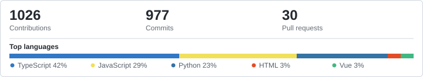

<!--
**BK201-Drama/BK201-Drama** is a ✨ special ✨ repository because its README appears on your GitHub profile.
-->

# Kaidi Lin

Full-stack · WeRide · Guangzhou

[Blog](https://bk201-drama.github.io/) · [GitHub](https://github.com/BK201-Drama?tab=repositories) · `BK201-Drama`

`TypeScript` `React` `NestJS` `Python` `Django`

 

## Experience

**Software Engineer · weval** · WeRide  
`2022.06 — Present`

**B.Eng. Software Engineering** · South China University of Technology  
`2019.09 — 2023.06`

## GitHub

## Stack

`Vue` `Node.js` `PostgreSQL` `Redis` `MongoDB` `MySQL`  
`Now · learning-agent`
