<!--
**BK201-Drama/BK201-Drama** is a ✨ special ✨ repository because its README appears on your GitHub profile.

Badges are local SVGs under profile/badges/ so they are not clickable camo links.
-->

<table>
  <tr>
    <td valign="middle" width="730">
      <h1>Kaidi Lin</h1>
      
<code>BK201-Drama</code> · Full-stack Engineer

      

        <a href="https://bk201-drama.github.io/">Blog</a> ·
        <a href="https://github.com/BK201-Drama?tab=repositories">Repositories</a> ·
        Guangzhou · GitHub since 2020
      

      

        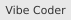
        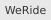
        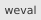
        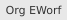
        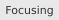
      

    </td>
    <td valign="middle" width="190" align="right">
      
    </td>
  </tr>
</table>

## Experience & Education

**Software Engineer · weval** · WeRide  
`2022.06 — Present`

**B.Eng. Software Engineering** · South China University of Technology  
`2019.09 — 2023.06`

## Selected Metrics

## Projects & Skills

<table>
  <tr>
    <td valign="top" width="380">
      

        <b>dataFountain_0.8961</b> · <code>Python</code> 
        个贷违约预测 · A榜 #72 · B榜 #61 
        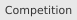
        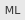
      

      

        <b>learning-agent</b> · <code>TypeScript</code> 
        本地学习助手 · 当前主线 
        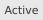
        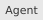
      

      

        <b>agent-farm-cli</b> · <code>TypeScript</code> 
        本地 agent 队列 / 执行基础设施 
        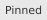
        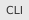
      

      

        <b>stock-dashboard</b> · <code>Python</code> 
        内部量化看板 
        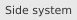
      

    </td>
    <td valign="top" width="540">
      
<b>LANGUAGES</b>

      
      
<b>FRONTEND</b> 
        
        
        
        
        
        
      

      
<b>BACKEND & DATA</b> 
        
        
        
        
        
        
        
        
      

    </td>
  </tr>
</table>
